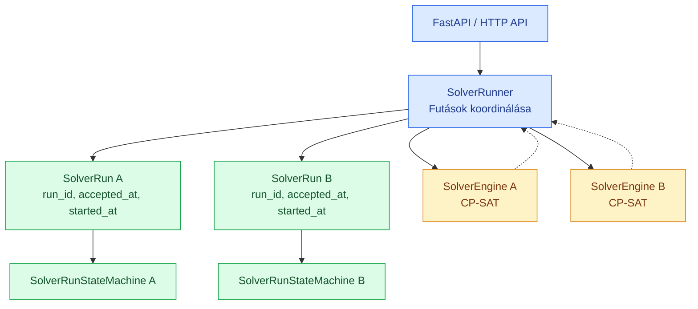

# Solver lifecycle architecture

## Requirements view

The important ownership relations:

- The SolverRun owns its state machine and time data
- The SolverRunner coordinates the running instances and enforces resource limits
- The Engine (OP Tools) does the optimizations
- The SolverRunStateMachine / SolverRun does not measure time periods and does not initiate calculations

