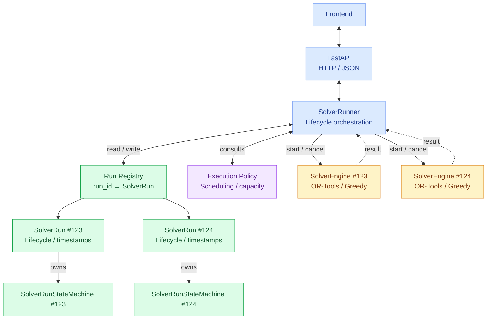
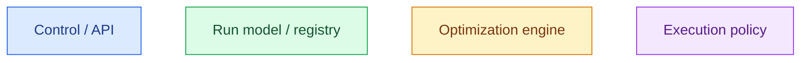
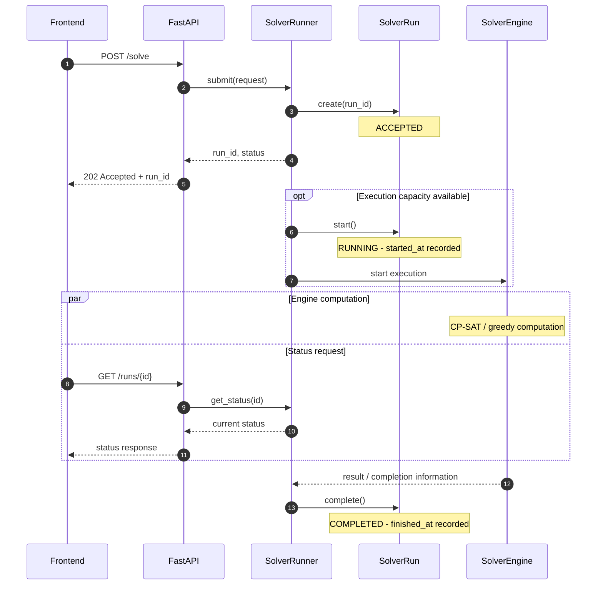

# Solver lifecycle architecture

## Requirements view

The important responsibility and ownership relations are:

- `SolverRun` owns its `SolverRunStateMachine` and lifecycle timestamps.
- `SolverRunStateMachine` validates state transitions; it neither measures time nor initiates calculations.
- `SolverRun` records event timestamps, but does not measure execution durations or run optimization itself.
- `SolverRunner` coordinates runs, their lifecycle events and execution resources.
- `SolverEngine` performs the actual optimization (OR-Tools CP-SAT or the required greedy baseline).
- The Engine's computational result and the `SolverRun` lifecycle state are distinct concepts.

## Extended logical architecture

### Legend

Solid arrows show coordination, access or ownership as indicated by their labels. Dashed arrows from the Engines represent results or termination information returned to the Runner; they do **not** prescribe callbacks, threads or processes.

### Architecture notes

- **Decided responsibility split:** The Runner coordinates lifecycle events; the `SolverRun` owns its state machine and timestamps; the Engine performs calculations. The Engine must not directly mutate the `SolverRun` lifecycle.
- **Logical components, not necessarily classes:** The Run Registry and Execution Policy express responsibilities of the Runner. Whether to implement them as separate Python classes remains open.
- **Illustrative instances:** Runs `#123` and `#124` and the two Engine boxes illustrate multiple jobs and executions. They neither require a permanent one-to-one Run–Engine ownership relation nor imply simultaneous optimization.
- **Capacity and scheduling:** The number of simultaneously active Engines, queuing, execution mechanism (threads/processes), cancellation coordination and resource limits remain design decisions (specification F4/D6).
- **Deployment:** One logical Runner does not automatically imply one shared Python instance across multiple server processes. Deployment and shared-state strategy remain open.
- **Result ownership (open):** The `SolverEngine` returns its computational result to the `SolverRunner`. The Runner associates the result with the corresponding run. Whether the result is stored directly in `SolverRun` or in a separate result store remains to be decided. Engine instances do not need to remain alive for completed runs.

## Runtime interaction — proposed successful run

The following sequence shows one *possible* asynchronous execution flow; it is **not yet an implemented API contract or execution mechanism**. In particular, it does not decide the cancellation semantics of an `ACCEPTED` run.

### Timestamp semantics

- `accepted_at`: time at which the run is accepted and registered.
- `started_at`: time at which the run transitions successfully to `RUNNING`.
- `finished_at` (**proposed**, not yet implemented): time at which the run successfully enters a terminal lifecycle state, rather than the Engine's exact computation-stop time.
- These timestamps are UTC `datetime` values. Durations and solver statistics can be evaluated separately; the Engine may expose its own computation timing.

The diagram shows successful completion only. Cancellation, timeouts, failure handling and any waiting queue require separate decisions and tests.
