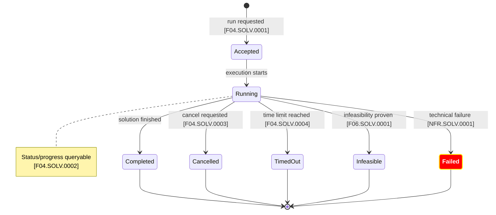

# Solver Run Lifecycle

## Requirements view

This diagram shows the externally observable Solver-run lifecycle implied by
the system requirements.

It does not yet define the implementation state machine.

